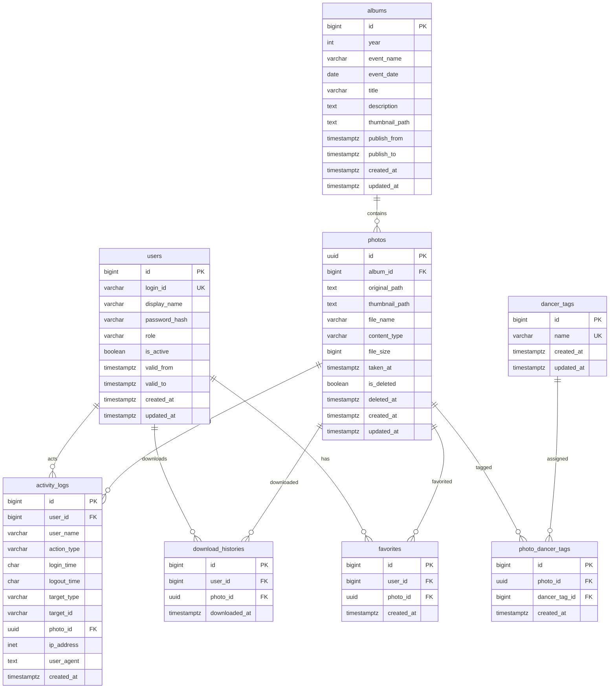

# YOSAKOI PHOTO ARCHIVE DB設計・ER図

## 1. 設計方針

`requirements.md` のテーブル要件を基準に、MVP で必要な制約、関連、インデックスを整理します。

主な方針:

- 写真削除は論理削除とし、`photos.is_deleted` と `photos.deleted_at` で管理する。
- ユーザー削除は要件上明示されていないため、MVP では `is_active` による無効化を基本とする。
- R2 の画像は DB にバイナリ保存せず、オブジェクトキーまたはパスを保存する。
- お気に入り、タグ、ダウンロード履歴はユーザー・写真を関連付ける履歴/中間テーブルとして扱う。
- 操作監査は `activity_logs` に集約する。

## 2. テーブル一覧

| テーブル | 目的 |
| --- | --- |
| users | ログインユーザー、管理者、利用期間を管理 |
| albums | 年度・イベント単位のアルバムを管理 |
| photos | アルバムに紐づく写真メタ情報とR2パスを管理 |
| dancer_tags | 踊り子タグ、役割タグを管理 |
| photo_dancer_tags | 写真とタグの多対多関連 |
| favorites | ユーザーごとのお気に入り写真 |
| download_histories | ユーザーごとの写真ダウンロード履歴 |
| activity_logs | ログイン、アップロード、削除等の操作ログ |

## 3. テーブル定義

### 3.1 users

ユーザーアカウント、権限、有効期間を管理します。

| カラム | 型 | NULL | 制約/補足 |
| --- | --- | --- | --- |
| id | BIGSERIAL | NO | PK |
| login_id | VARCHAR(100) | NO | UNIQUE |
| display_name | VARCHAR(100) | NO | 表示名 |
| password_hash | VARCHAR(255) | NO | bcrypt ハッシュ |
| role | VARCHAR(20) | NO | `admin` / `member` |
| is_active | BOOLEAN | NO | default true |
| valid_from | TIMESTAMPTZ | NO | 利用開始日時 |
| valid_to | TIMESTAMPTZ | NO | 利用終了日時 |
| created_at | TIMESTAMPTZ | NO | default now() |
| updated_at | TIMESTAMPTZ | NO | 要件外だが編集管理用に推奨 |

制約:

- `login_id` は一意。
- `role` は `admin` または `member` に限定。
- `valid_from <= valid_to` をチェック。

### 3.2 albums

年度・イベント単位のアルバム情報と公開期間を管理します。

| カラム | 型 | NULL | 制約/補足 |
| --- | --- | --- | --- |
| id | BIGSERIAL | NO | PK |
| year | INTEGER | NO | 例: 2026 |
| event_name | VARCHAR(100) | NO | 例: 本祭1日目 |
| event_date | DATE | NO | アルバム開催日。Exif未取得時の撮影日時補完に使用 |
| title | VARCHAR(150) | NO | アルバムタイトル |
| description | TEXT | YES | 説明 |
| thumbnail_path | TEXT | YES | R2上のサムネイルパス |
| publish_from | TIMESTAMPTZ | NO | 公開開始日時 |
| publish_to | TIMESTAMPTZ | NO | 公開終了日時 |
| created_at | TIMESTAMPTZ | NO | default now() |
| updated_at | TIMESTAMPTZ | NO | 要件外だが編集管理用に推奨 |

制約:

- `publish_from <= publish_to` をチェック。
- 一覧表示では公開期間内のアルバムのみ一般ユーザーへ返す。
- `event_date` は写真の Exif 撮影日時が取得できない場合の補完候補として使用する。

### 3.3 photos

写真ファイルの保存先、撮影日時、削除状態を管理します。

| カラム | 型 | NULL | 制約/補足 |
| --- | --- | --- | --- |
| id | UUID | NO | PK、写真IDとして外部公開しやすい |
| album_id | BIGINT | NO | FK: albums.id |
| original_path | TEXT | NO | R2原本画像パス |
| thumbnail_path | TEXT | NO | R2サムネイル画像パス |
| file_name | VARCHAR(255) | NO | 元ファイル名 |
| content_type | VARCHAR(100) | NO | `image/jpeg` 等、推奨追加 |
| file_size | BIGINT | YES | 運用・監査用、推奨追加 |
| taken_at | TIMESTAMPTZ | NO | Exifまたは補完日時 |
| is_deleted | BOOLEAN | NO | default false |
| deleted_at | TIMESTAMPTZ | YES | 論理削除日時 |
| created_at | TIMESTAMPTZ | NO | default now() |
| updated_at | TIMESTAMPTZ | NO | 要件外だが編集管理用に推奨 |

制約:

- `album_id` は `albums.id` を参照。
- `is_deleted = false` の写真のみ一般ユーザーへ表示。
- `deleted_at` は `is_deleted = true` のとき設定する。

### 3.4 dancer_tags

踊り子名、役割名などのタグを管理します。

| カラム | 型 | NULL | 制約/補足 |
| --- | --- | --- | --- |
| id | BIGSERIAL | NO | PK |
| name | VARCHAR(100) | NO | UNIQUE |
| created_at | TIMESTAMPTZ | NO | default now() |
| updated_at | TIMESTAMPTZ | NO | 要件外だが編集管理用に推奨 |

制約:

- `name` は一意。
- 削除済みタグの扱いは MVP では物理削除または参照有無チェックを検討する。

### 3.5 photo_dancer_tags

写真とタグの多対多関連を管理します。

| カラム | 型 | NULL | 制約/補足 |
| --- | --- | --- | --- |
| id | BIGSERIAL | NO | PK |
| photo_id | UUID | NO | FK: photos.id |
| dancer_tag_id | BIGINT | NO | FK: dancer_tags.id |
| created_at | TIMESTAMPTZ | NO | default now() |

制約:

- `(photo_id, dancer_tag_id)` は一意。
- 写真削除時もタグ関連は残し、表示時に `photos.is_deleted = false` で除外する。

### 3.6 favorites

ユーザーのお気に入り写真を管理します。

| カラム | 型 | NULL | 制約/補足 |
| --- | --- | --- | --- |
| id | BIGSERIAL | NO | PK |
| user_id | BIGINT | NO | FK: users.id |
| photo_id | UUID | NO | FK: photos.id |
| created_at | TIMESTAMPTZ | NO | default now() |

制約:

- `(user_id, photo_id)` は一意。
- お気に入り一覧は `created_at DESC` で表示。

### 3.7 download_histories

写真単位のダウンロード履歴を管理します。

| カラム | 型 | NULL | 制約/補足 |
| --- | --- | --- | --- |
| id | BIGSERIAL | NO | PK |
| user_id | BIGINT | NO | FK: users.id |
| photo_id | UUID | NO | FK: photos.id |
| downloaded_at | TIMESTAMPTZ | NO | default now() |

補足:

- ダウンロード済み表示は `(user_id, photo_id)` の存在有無で判定する。
- 同じ写真を複数回ダウンロードした履歴を残すため、一意制約は付けない。

### 3.8 activity_logs

ログイン、アップロード、削除、ユーザー操作等の監査ログを管理します。

| カラム | 型 | NULL | 制約/補足 |
| --- | --- | --- | --- |
| id | BIGSERIAL | NO | PK |
| user_id | BIGINT | YES | FK: users.id、ログイン失敗時はNULL可 |
| user_name | VARCHAR(100) | YES | 操作時点の表示名を保存、推奨追加 |
| action_type | VARCHAR(50) | NO | 操作種別 |
| login_time | CHAR(12) | YES | ログイン成功時刻、YYYYMMDDHHMM形式 |
| logout_time | CHAR(12) | YES | ログアウト時刻、YYYYMMDDHHMM形式 |
| target_type | VARCHAR(50) | YES | `photo` / `user` / `album` 等、推奨追加 |
| target_id | VARCHAR(100) | YES | 対象ID |
| photo_id | UUID | YES | 写真関連ログ用、要件項目 |
| ip_address | INET | YES | IPアドレス |
| user_agent | TEXT | YES | User-Agent |
| created_at | TIMESTAMPTZ | NO | default now() |

主な `action_type`:

- `login_success`
- `login_failed`
- `logout`
- `photo_download`
- `photo_upload`
- `photo_delete`
- `user_create`
- `user_deactivate`
- `album_create`
- `album_update`
- `tag_create`
- `tag_update`
- `tag_delete`

## 4. ER図



## 5. インデックス設計

### 5.1 要件上必須のインデックス

| テーブル | インデックス対象 |
| --- | --- |
| photos | album_id |
| photos | taken_at |
| photos | is_deleted |
| favorites | user_id |
| favorites | photo_id |
| dancer_tags | name |
| photo_dancer_tags | photo_id |
| photo_dancer_tags | dancer_tag_id |
| activity_logs | user_id |
| activity_logs | created_at |
| activity_logs | login_time |
| activity_logs | logout_time |
| download_histories | user_id |
| download_histories | photo_id |

### 5.2 推奨追加インデックス

| テーブル | インデックス対象 | 目的 |
| --- | --- | --- |
| users | login_id UNIQUE | ログイン検索 |
| users | is_active, valid_from, valid_to | 有効ユーザー判定 |
| albums | year, event_name | 年度・イベント検索 |
| albums | publish_from, publish_to | 公開期間判定 |
| photos | album_id, is_deleted, taken_at | アルバム写真一覧 |
| photos | created_at | 最近追加された写真 |
| dancer_tags | lower(name) UNIQUE | タグ名の重複防止を強める場合 |
| photo_dancer_tags | photo_id, dancer_tag_id UNIQUE | 同一タグ重複付与防止 |
| favorites | user_id, photo_id UNIQUE | 同一写真の重複お気に入り防止 |
| favorites | user_id, created_at | お気に入り一覧 |
| download_histories | user_id, photo_id | ダウンロード済み表示 |
| activity_logs | action_type, created_at | ログ検索 |
| activity_logs | login_time, logout_time | ログイン・ログアウト時刻検索 |

## 6. データ取得時の基本条件

一般ユーザー向け写真表示:

```text
users.is_active = true
AND current_timestamp BETWEEN users.valid_from AND users.valid_to
AND albums.publish_from <= current_timestamp
AND albums.publish_to >= current_timestamp
AND photos.is_deleted = false
```

管理者向け写真表示:

```text
users.role = 'admin'
AND users.is_active = true
AND current_timestamp BETWEEN users.valid_from AND users.valid_to
```

MVP では、管理者画面の通常写真一覧でも論理削除済み写真は表示対象外とします。
復旧画面、削除済み一覧、R2 物理削除は MVP 後の運用機能として別途検討します。

## 7. 未確定事項

| 項目 | 論点 | 推奨 |
| --- | --- | --- |
| 写真IDの型 | 要件は id のみ指定 | UUID を推奨 |
| R2パス | 要件例は日本語イベント名を含む | MVPでは年度、アルバムID、写真UUIDを使い、日本語イベント名は直接使わない |
| タグ削除 | 既に写真へ付与されたタグの削除 | MVPでは参照がある場合は削除不可 |
| 管理者初期作成 | 自己登録なし | seed または環境変数から初期管理者作成 |
| activity_logs の target | 要件は target_id のみ | target_type 追加を推奨 |
