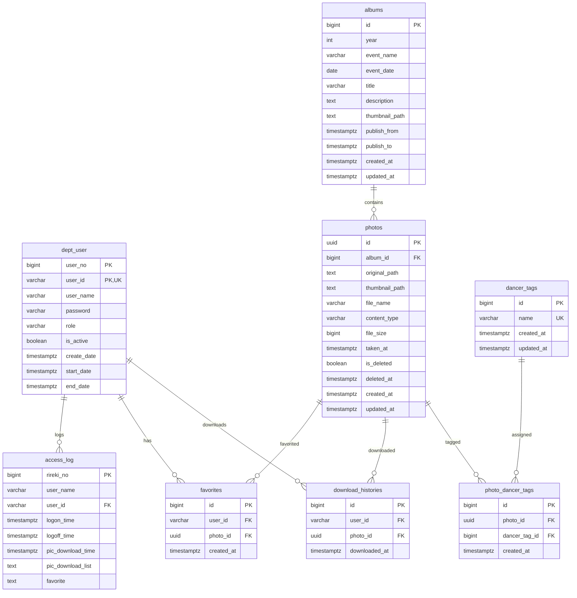

# YOSAKOI PHOTO ARCHIVE DB設計・ER図

## 1. 設計方針

`requirements.md` と現在の実装を基準に、MVP で必要な制約、関連、インデックスを整理します。

主な方針:

- ユーザーアカウントと利用期間は `dept_user` で管理する。
- ログイン、ログアウト、写真ダウンロード、お気に入り関連のアクセス履歴は `access_log` で管理する。
- JWT は HttpOnly Cookie で保持し、`ACCESS_TOKEN_EXPIRE_MINUTES` による30分アイドルタイムアウトを行う。
- 写真削除は論理削除とし、`photos.is_deleted` と `photos.deleted_at` で管理する。
- R2 の画像は DB にバイナリ保存せず、オブジェクトキーまたはパスを保存する。
- お気に入り、タグ、ダウンロード履歴はユーザー・写真を関連付ける履歴/中間テーブルとして扱う。

## 2. テーブル一覧

| テーブル | 目的 |
| --- | --- |
| dept_user | ログインユーザー、管理者、利用期間を管理 |
| access_log | ログイン、ログアウト、写真ダウンロード、お気に入り関連のアクセス履歴を管理 |
| albums | 年度・イベント単位のアルバムを管理 |
| photos | アルバムに紐づく写真メタ情報とR2パスを管理 |
| dancer_tags | 踊り子タグ、役割タグを管理 |
| photo_dancer_tags | 写真とタグの多対多関連 |
| favorites | ユーザーごとのお気に入り写真 |
| download_histories | ユーザーごとの写真ダウンロード履歴 |

## 3. テーブル定義

### 3.1 dept_user

ユーザーアカウント、権限、有効期間を管理します。

| カラム | 型 | NULL | 制約/補足 |
| --- | --- | --- | --- |
| user_no | BIGSERIAL | NO | PK、内部ユーザー番号 |
| user_id | VARCHAR(100) | NO | PK、UNIQUE、ログインID |
| user_name | VARCHAR(100) | NO | 表示名 |
| password | VARCHAR(255) | NO | bcrypt ハッシュ |
| role | VARCHAR(20) | NO | `admin` / `member`。README要件にはないが認可に必要な追加カラム |
| is_active | BOOLEAN | NO | default true。README要件にはないが有効化/無効化に必要な追加カラム |
| create_date | TIMESTAMPTZ | NO | default now() |
| start_date | TIMESTAMPTZ | NO | 利用開始日時 |
| end_date | TIMESTAMPTZ | NO | 利用終了日時 |

制約:

- `user_id` は一意。
- 主キーは `(user_no, user_id)`。
- `role` は `admin` または `member` に限定。
- `start_date <= end_date` をチェック。

### 3.2 access_log

ログイン、ログアウト、写真ダウンロード、お気に入り情報を管理します。

| カラム | 型 | NULL | 制約/補足 |
| --- | --- | --- | --- |
| rireki_no | BIGSERIAL | NO | PK |
| user_name | VARCHAR(100) | YES | 操作時点の表示名 |
| user_id | VARCHAR(100) | YES | FK: dept_user.user_id、ログイン失敗時はNULL可 |
| logon_time | TIMESTAMPTZ | YES | ログイン日時。dept_user.create_date と同じ日時型 |
| logoff_time | TIMESTAMPTZ | YES | ログアウト日時。dept_user.create_date と同じ日時型 |
| pic_download_time | TIMESTAMPTZ | YES | 写真ダウンロード日時。dept_user.create_date と同じ日時型 |
| pic_download_list | TEXT | YES | ダウンロードした写真IDまたは一覧 |
| favorite | TEXT | YES | お気に入り対象の写真IDまたは一覧 |

補足:

- 現行実装ではログイン成功時に `logon_time` を登録し、ログアウト時に未ログアウトの最新行へ `logoff_time` を更新する。
- 写真ダウンロード時は `pic_download_time` と `pic_download_list` を登録する。

### 3.3 albums

年度・イベント単位のアルバム情報と公開期間を管理します。

| カラム | 型 | NULL | 制約/補足 |
| --- | --- | --- | --- |
| id | BIGSERIAL | NO | PK |
| year | INTEGER | NO | 例: 2026 |
| event_name | VARCHAR(100) | NO | 例: 本祭1日目 |
| event_date | DATE | NO | アルバム開催日。Exif未取得時の撮影日時補完に使用 |
| title | VARCHAR(150) | NO | アルバムタイトル |
| description | TEXT | YES | 説明 |
| thumbnail_path | TEXT | YES | R2上のサムネイルパス |
| publish_from | TIMESTAMPTZ | NO | 公開開始日時 |
| publish_to | TIMESTAMPTZ | NO | 公開終了日時 |
| created_at | TIMESTAMPTZ | NO | default now() |
| updated_at | TIMESTAMPTZ | NO | 編集管理用 |

制約:

- `publish_from <= publish_to` をチェック。
- 一覧表示では公開期間内のアルバムのみ一般ユーザーへ返す。

### 3.4 photos

写真ファイルの保存先、撮影日時、削除状態を管理します。

| カラム | 型 | NULL | 制約/補足 |
| --- | --- | --- | --- |
| id | UUID | NO | PK、写真IDとして外部公開しやすい |
| album_id | BIGINT | NO | FK: albums.id |
| original_path | TEXT | NO | R2原本画像パス |
| thumbnail_path | TEXT | NO | R2サムネイル画像パス |
| file_name | VARCHAR(255) | NO | 元ファイル名 |
| content_type | VARCHAR(100) | NO | `image/jpeg` 等 |
| file_size | BIGINT | YES | 運用・監査用 |
| taken_at | TIMESTAMPTZ | NO | Exifまたは補完日時 |
| is_deleted | BOOLEAN | NO | default false |
| deleted_at | TIMESTAMPTZ | YES | 論理削除日時 |
| created_at | TIMESTAMPTZ | NO | default now() |
| updated_at | TIMESTAMPTZ | NO | 編集管理用 |

### 3.5 dancer_tags

踊り子名、役割名などのタグを管理します。

| カラム | 型 | NULL | 制約/補足 |
| --- | --- | --- | --- |
| id | BIGSERIAL | NO | PK |
| name | VARCHAR(100) | NO | UNIQUE |
| created_at | TIMESTAMPTZ | NO | default now() |
| updated_at | TIMESTAMPTZ | NO | 編集管理用 |

### 3.6 photo_dancer_tags

写真とタグの多対多関連を管理します。

| カラム | 型 | NULL | 制約/補足 |
| --- | --- | --- | --- |
| id | BIGSERIAL | NO | PK |
| photo_id | UUID | NO | FK: photos.id |
| dancer_tag_id | BIGINT | NO | FK: dancer_tags.id |
| created_at | TIMESTAMPTZ | NO | default now() |

制約:

- `(photo_id, dancer_tag_id)` は一意。

### 3.7 favorites

ユーザーのお気に入り写真を管理します。

| カラム | 型 | NULL | 制約/補足 |
| --- | --- | --- | --- |
| id | BIGSERIAL | NO | PK |
| user_id | VARCHAR(100) | NO | FK: dept_user.user_id |
| photo_id | UUID | NO | FK: photos.id |
| created_at | TIMESTAMPTZ | NO | default now() |

制約:

- `(user_id, photo_id)` は一意。

### 3.8 download_histories

写真単位のダウンロード履歴を管理します。

| カラム | 型 | NULL | 制約/補足 |
| --- | --- | --- | --- |
| id | BIGSERIAL | NO | PK |
| user_id | VARCHAR(100) | NO | FK: dept_user.user_id |
| photo_id | UUID | NO | FK: photos.id |
| downloaded_at | TIMESTAMPTZ | NO | default now() |

補足:

- ダウンロード済み表示は `(user_id, photo_id)` の存在有無で判定する。
- 同じ写真を複数回ダウンロードした履歴を残すため、一意制約は付けない。

## 4. ER図



## 5. インデックス設計

### 5.1 要件上必須のインデックス

| テーブル | インデックス対象 |
| --- | --- |
| dept_user | user_id |
| dept_user | role |
| dept_user | is_active |
| access_log | user_id |
| access_log | logon_time |
| access_log | logoff_time |
| access_log | pic_download_time |
| photos | album_id |
| photos | taken_at |
| photos | is_deleted |
| favorites | user_id |
| favorites | photo_id |
| dancer_tags | name |
| photo_dancer_tags | photo_id |
| photo_dancer_tags | dancer_tag_id |
| download_histories | user_id |
| download_histories | photo_id |

### 5.2 推奨追加インデックス

| テーブル | インデックス対象 | 目的 |
| --- | --- | --- |
| dept_user | user_id UNIQUE | ログイン検索 |
| dept_user | is_active, start_date, end_date | 有効ユーザー判定 |
| albums | year, event_name | 年度・イベント検索 |
| albums | publish_from, publish_to | 公開期間判定 |
| photos | album_id, is_deleted, taken_at | アルバム写真一覧 |
| photos | created_at | 最近追加された写真 |
| dancer_tags | lower(name) UNIQUE | タグ名の重複防止を強める場合 |
| photo_dancer_tags | photo_id, dancer_tag_id UNIQUE | 同一タグ重複付与防止 |
| favorites | user_id, photo_id UNIQUE | 同一写真の重複お気に入り防止 |
| favorites | user_id, created_at | お気に入り一覧 |
| download_histories | user_id, photo_id | ダウンロード済み表示 |
| access_log | user_id, logon_time | ログイン履歴検索 |
| access_log | user_id, pic_download_time | ダウンロード履歴検索 |

## 6. データ取得時の基本条件

一般ユーザー向け写真表示:

```text
dept_user.is_active = true
AND current_timestamp BETWEEN dept_user.start_date AND dept_user.end_date
AND albums.publish_from <= current_timestamp
AND albums.publish_to >= current_timestamp
AND photos.is_deleted = false
```

管理者向け写真表示:

```text
dept_user.role = 'admin'
AND dept_user.is_active = true
AND current_timestamp BETWEEN dept_user.start_date AND dept_user.end_date
```

MVP では、管理者画面の通常写真一覧でも論理削除済み写真は表示対象外とします。
復旧画面、削除済み一覧、R2 物理削除は MVP 後の運用機能として別途検討します。

## 7. 未確定事項

| 項目 | 論点 | 推奨 |
| --- | --- | --- |
| 写真IDの型 | 要件は id のみ指定 | UUID を推奨 |
| R2パス | 要件例は日本語イベント名を含む | MVPでは年度、アルバムID、写真UUIDを使い、日本語イベント名は直接使わない |
| タグ削除 | 既に写真へ付与されたタグの削除 | MVPでは参照がある場合は削除不可 |
| 管理者初期作成 | 自己登録なし | 環境変数から `dept_user` に初期管理者を作成 |
| access_log の favorite | 単一写真IDか一覧文字列か | MVPでは単一操作ごとに1行記録し、必要なら後続で正規化する |
